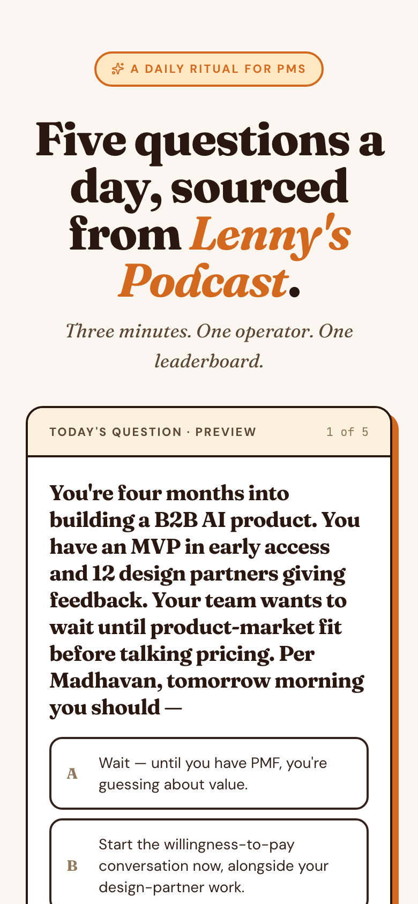
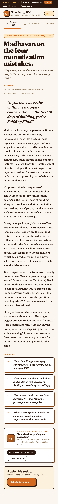
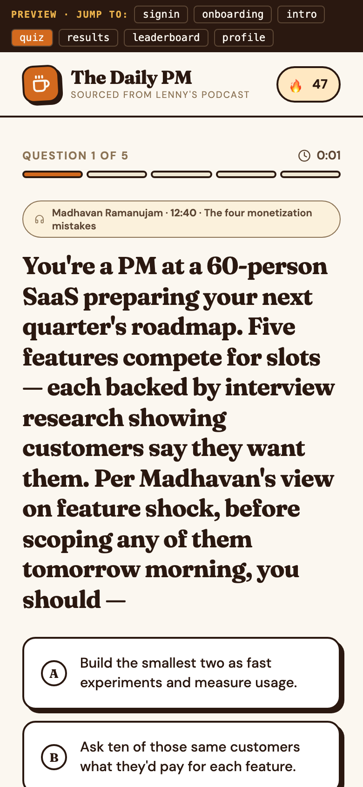
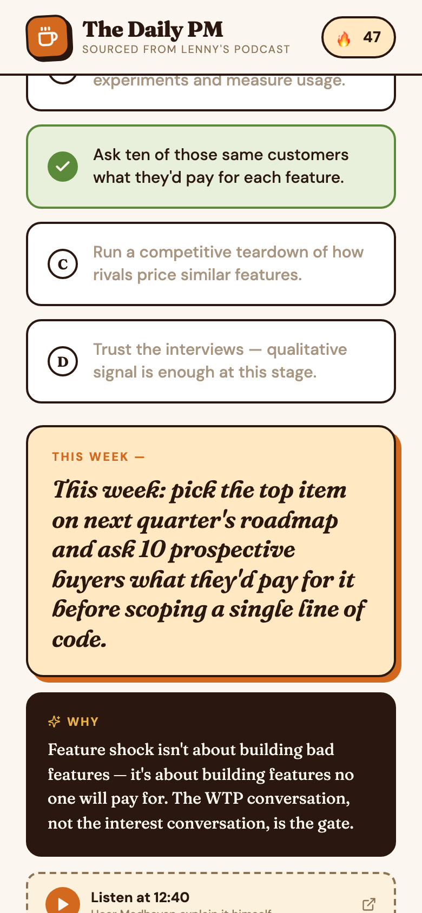
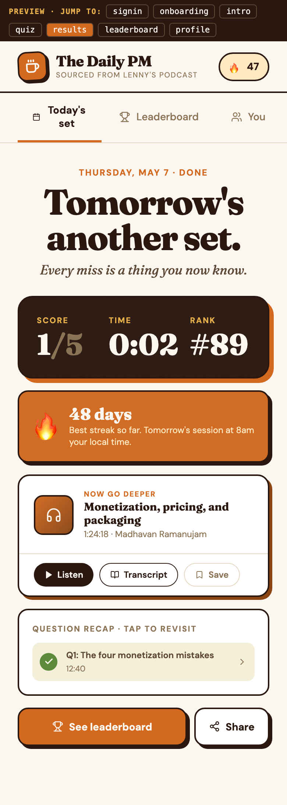
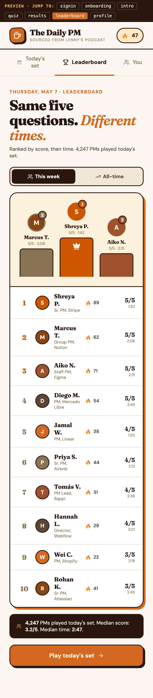
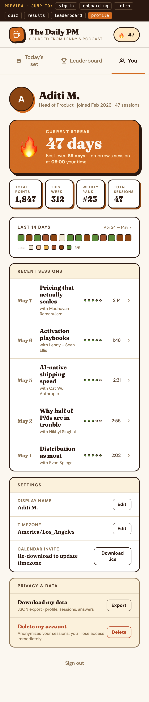

# PM Daily

Daily learning sessions + applied quiz + leaderboard for product managers,
distilled from Lenny Rachitsky's podcast and newsletter archive.

**Live:** https://daily.deepikamurthy.com

## Demo


Full-quality MP4: [`docs/demo.mp4`](docs/demo.mp4) · Live app: https://daily.deepikamurthy.com

## Screens

The flow: land → read today's digest → take 5 questions → see takeaways → climb the leaderboard.

<table>
<tr>
<td width="50%"><strong>Landing</strong> — anonymous preview question, sign-in CTAs<br/></td>
<td width="50%"><strong>Today's digest</strong> — operator headline, 5-min read, takeaways<br/></td>
</tr>
<tr>
<td><strong>Quiz</strong> — first-person scenario, four options<br/></td>
<td><strong>Result panel</strong> — pm_takeaway as the visual hero<br/></td>
</tr>
<tr>
<td><strong>Final summary</strong> — score, time, rank, streak, recap<br/></td>
<td><strong>Leaderboard</strong> — weekly + all-time, podium for top 3<br/></td>
</tr>
<tr>
<td colspan="2" align="center"><strong>Profile</strong> — streak hero, 14-day heatmap, recent sessions, GDPR controls<br/></td>
</tr>
</table>

## Submission writeup

For judges: **[`docs/submission.md`](docs/submission.md)** — half-page abstract covering the problem, what's novel, sponsor-track relevance, the two-AI build process, and how to evaluate (three paths, fastest first).

End-to-end **AI pipeline trace** for a real Cat Wu episode (Pass 0 thesis brief → Pass 1 overgenerate 7 → Pass 2 self-review keep 5 → Pass 3 programmatic citation literal-match → final shipped JSON, including one synthetic citation-drift retry): **[`docs/pipeline-demo/cat-wu-2026-04-23/`](docs/pipeline-demo/cat-wu-2026-04-23/)**.

## Repository layout

- `apps/web` — SvelteKit web app on Cloudflare Workers (D1, KV, Durable Objects, cron)
- `scripts` — Nightly content pipeline (Plan A — not yet implemented)
- `prompts/question-generation` — Versioned Claude prompts for the daily content generator
- `docs/superpowers/specs` — Design spec (one canonical doc)
- `docs/superpowers/plans` — Implementation plans (web app, content pipeline, design remediation)
- `mockups` — Static HTML design references (canonical UI, palette comparison)
- `lenny-daily-quiz.jsx` — React reference component for the canonical aesthetic
- `preview.html` — Standalone browser preview of the reference component (Babel + esm.sh)

## Tech stack

SvelteKit 2 (Svelte 5 runes mode) · Tailwind v3 · Drizzle ORM · Better Auth (magic link + Google OAuth) · Lucide icons · Cloudflare Workers + D1 + KV + Durable Objects + cron · Vitest + Playwright

## License + source material

This repository is open source. Code is MIT-licensed — see
[`LICENSE`](LICENSE).

Maintainer intent: Product Gym is a free learning project. I do not plan to
monetize the hosted app; the goal is to help PMs and builders practice product
judgment from great operator conversations.

Quiz questions, digests, and takeaways are derivative summaries
generated from Lenny Rachitsky's archive (podcasts and newsletter
posts). Original sources retain their rights; this repository contains
no full episodes or full posts. Excerpt quotations used in question
citations are short (≤280 characters) and attributable, with direct
links back to the original. See [`NOTICE`](NOTICE) for the full
source-material clarification.

This is a personal hackathon submission and is not officially
affiliated with Lenny's Newsletter, Lenny's Podcast, or Lenny Rachitsky.

## Local development

```bash
cd apps/web
pnpm install
pnpm exec wrangler d1 migrations apply pm-daily --local   # one-time
pnpm dev                                                  # starts at :5173
curl -X POST http://localhost:5173/api/_dev/seed          # seeds today's content
```

Then open `http://localhost:5173/`. Sign-in flows require
`GOOGLE_CLIENT_ID`/`GOOGLE_CLIENT_SECRET` and `RESEND_API_KEY` in
`apps/web/.dev.vars` — see `.env.example`.

## Cloudflare resource IDs (for forks)

The committed `apps/web/wrangler.toml` references account-scoped resource
IDs from the original deployment. Forks should run:

```bash
wrangler d1 create pm-daily               # → copy database_id
wrangler kv namespace create pm-daily-kv  # → copy id
wrangler vectorize create lennys_metadata --dimensions=1024 --metric=cosine
```

…and replace the IDs in `wrangler.toml` accordingly.

## Deploy

```bash
cd apps/web
pnpm build && pnpm exec wrangler deploy
```

Worker secrets (set via `wrangler secret put`):
`BETTER_AUTH_SECRET`, `BETTER_AUTH_URL`, `GOOGLE_CLIENT_ID`,
`GOOGLE_CLIENT_SECRET`, `RESEND_API_KEY`, `PUBLIC_POSTHOG_KEY`.

Production auth/domain configuration:

- Canonical app URL: `https://daily.deepikamurthy.com`
- Better Auth fallback URL: set `BETTER_AUTH_URL` to `https://daily.deepikamurthy.com`
- Google OAuth authorized origin: `https://daily.deepikamurthy.com`
- Google OAuth redirect URI: `https://daily.deepikamurthy.com/auth/callback/google`

Keep the Workers preview URL (`https://pm-daily.avalanche05.workers.dev`) in
Google OAuth only if that domain should continue to support sign-in directly.

Analytics:

- Product analytics are sent to PostHog when `PUBLIC_POSTHOG_KEY` is set.
- `PUBLIC_POSTHOG_HOST` defaults to `https://us.i.posthog.com` in `wrangler.toml`.
- The app still posts events to `/api/analytics` for Worker log debugging.
</content>
